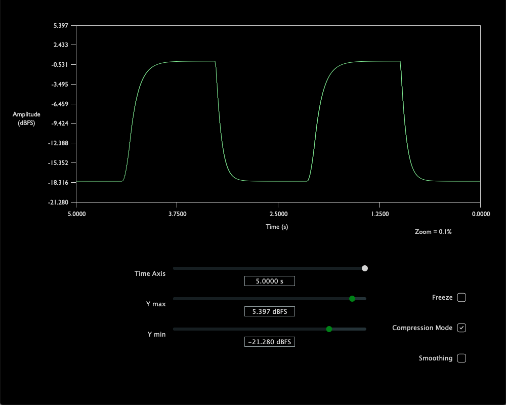

# CompressOScope

The CompressOScope is an application which allows you to calculate and visualize a compressor's gain in real time. 

The CompressOScope was built with openFrameworks 0.11.0.

To set specific values on the GUI parameters, right click twice on the value you want to set, then type in the value you would like to set. 
To cycle in fine measurements between values of the GUI parameters, mouse over the desired parameter, then scroll up or down on the value slowly.
